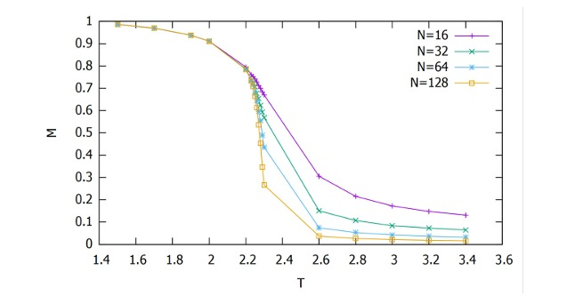

# 🧊 2D Ising Model Simulation with Monte Carlo (Metropolis Algorithm)

This project simulates the behavior of a two-dimensional Ising model using the Metropolis Monte Carlo method. It was developed as part of a university course on statistical physics.

## 🧠 Context

The Ising model is a mathematical model of ferromagnetism in statistical mechanics. It consists of discrete variables (spins) that represent magnetic dipole moments of atomic spins. These spins are arranged in a lattice, and each spin interacts with its nearest neighbors.

The model is especially interesting due to its phase transition behavior: at low temperatures, spins tend to align (magnetization), and at high temperatures, thermal fluctuations dominate (disordered phase).

## 🧮 How It Works

- A 2D square lattice of size \( N \times N \) is initialized with random spins (+1 or -1).
- Periodic boundary conditions are applied.
- The system evolves through the Metropolis algorithm, which evaluates energy differences due to random spin flips and decides whether to accept the changes based on temperature.
- The magnetization is measured over time and saved to a file.
- The process is repeated for various temperatures and lattice sizes.

## 🖥️ File Structure

- `ising_model_montecarlo.f90`: Main simulation code written in Fortran 90.
- `Voluntario_Ising.pdf`: Report explaining the theoretical and computational background of the project.
- `magnetization_vs_temperature.png`: Plot showing the main result of the simulation.
- Output files (generated when running the code):  
  - `matrices_T=0.5K.dat`: Stores lattice states over time.  
  - `magnetizacion_T=0.5K.dat`: Stores magnetization vs. time.

## 🔬 Physical Interpretation

The key result is the observation of a **second-order phase transition** in magnetization:

### 📈 Results



**Figure:** Magnetization as a function of temperature for various system sizes. A clear phase transition is observed around the critical temperature \( T_c \approx 2.27 \), which is characteristic of the 2D Ising model.

As the temperature increases, the system transitions from an ordered magnetic state to a disordered one, which is a classical signature of spontaneous symmetry breaking.

## 🚀 How to Run

1. Compile the Fortran program using a compiler like `gfortran`:

```bash
gfortran -o ising_model ising_model_montecarlo.f90
