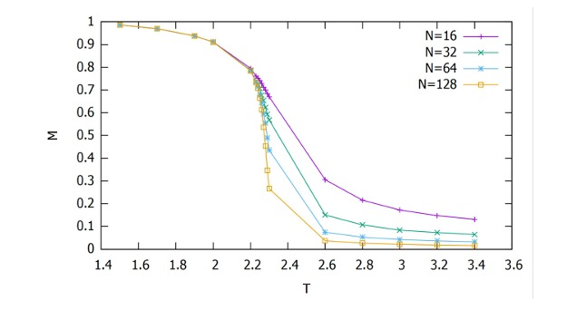
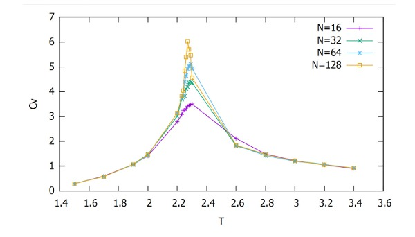
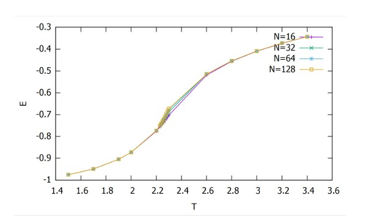
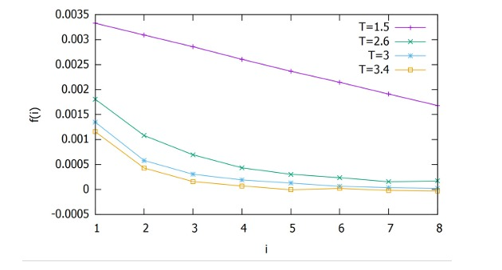
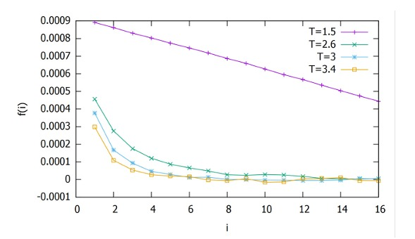
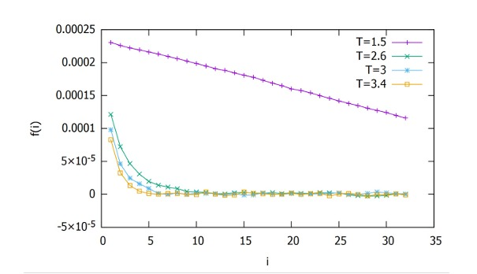
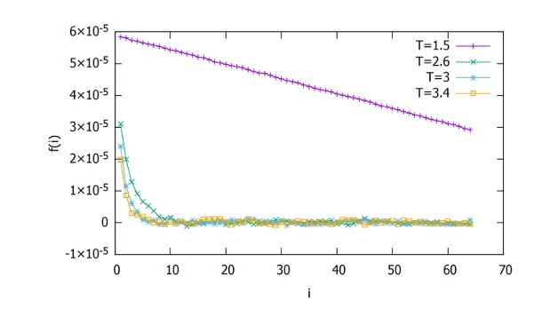

# 🧊 Modeling Phase Transitions in the 2D Ising Model using Monte Carlo Simulations  (When Physics Meets Data Science)
This project simulates the behavior of a two-dimensional Ising model using the Metropolis Monte Carlo method. It was developed as part of a university course on statistical physics.

## 🧠 Context

The Ising model is a mathematical model of ferromagnetism in statistical mechanics. It consists of discrete variables (spins) that represent magnetic dipole moments of atomic spins. These spins are arranged in a lattice, and each spin interacts with its nearest neighbors.

The model is especially interesting due to its phase transition behavior: at low temperatures, spins tend to align (magnetization), and at high temperatures, thermal fluctuations dominate (disordered phase).

## 🧮 How It Works

- A 2D square lattice of size \( N \times N \) is initialized with random spins (+1 or -1).
- Periodic boundary conditions are applied.
- The system evolves through the Metropolis algorithm, which evaluates energy differences due to random spin flips and decides whether to accept the changes based on temperature.
- The magnetization is measured over time and saved to a file.
- The process is repeated for various temperatures and lattice sizes.

## 🖥️ File Structure

- `ising_model_montecarlo.f90`: Main simulation code written in Fortran 90.
- `Voluntario_Ising.pdf`: Report explaining the theoretical and computational background of the project.
- `figures/`: Folder containing results visualizations.
  - `magnetization_vs_temperature.jpeg`
  - `specific_heat_vs_temperature.jpeg`
  - `mean_energy_vs_temperature.jpeg`
- Output files (generated when running the code):  
  - `matrices_T=0.5K.dat`: Stores lattice states over time.  
  - `magnetizacion_T=0.5K.dat`: Stores magnetization vs. time.

## 🔬 Physical Interpretation

The key result is the observation of a **second-order phase transition** in magnetization:

### 📈 Results

#### 🧲 Magnetization

**Figure 1:** Magnetization as a function of temperature for various system sizes. A clear phase transition is observed around the critical temperature \( T_c \approx 2.27 \), which is characteristic of the 2D Ising model. As the temperature increases, the system transitions from an ordered magnetic state to a disordered one, a classical signature of spontaneous symmetry breaking.

#### 🔥 Specific Heat

**Figure 2:** Specific heat as a function of temperature. We observe a peak near the critical temperature, and this peak becomes sharper and higher as the system size increases, in line with finite-size scaling theory.

| N   | Cv_max |
|-----|--------|
| 16  | 3.50   |
| 32  | 4.40   |
| 64  | 5.21   |
| 128 | 6.23   |

This behavior reflects the divergence of the specific heat at the phase transition in the thermodynamic limit.

#### ⚡ Mean Energy

**Figure 3:** Mean energy as a function of temperature. As expected, the energy increases with temperature. Around the critical point, the curve stabilizes slightly and fluctuations increase, resulting in higher uncertainty in the measurements.

## 📉 Correlation Function Analysis

We also analyzed the behavior of the spin-spin correlation function \( f(i) \), which measures the statistical dependence between spins at a given distance \( i \). We computed this for several temperatures and system sizes.

The following plots show the decay of \( f(i) \) for different system sizes \( N \) and temperatures \( T = 1.5, 2.6, 3, 3.4 \).

📊 **Correlation Function for Varying System Sizes**

-   
  **Figure 5:** Correlation function with \( N=16 \) for different temperatures.

-   
  **Figure 6:** Correlation function with \( N=32 \) for different temperatures.

-   
  **Figure 7:** Correlation function with \( N=64 \) for different temperatures.

-   
  **Figure 8:** Correlation function with \( N=128 \) for different temperatures.

📌 **Interpretation:**

- As expected, \( f(i) \) decreases with increasing \( i \), confirming the theoretical behavior that correlations vanish at large distances.
- Higher temperatures lead to faster decay, indicating the loss of magnetic order due to thermal fluctuations.
- Larger \( N \) values yield smoother and more accurate results, consistent with finite-size scaling theory.
## 🚀 How to Run

## 📐## 📐 Critical Exponents and Correlation Length

To extract deeper physical insights, we studied the critical exponents associated with the 2D Ising model's phase transition using our simulation results for **N = 128**, the size that best approximates the thermodynamic limit.

### 🔢 Critical Exponent: Beta (β)

To estimate the exponent **β**, which governs the behavior of magnetization near the critical temperature, we performed a nonlinear fit of the magnetization curve using the following function:

**f(T) = [A − B · sin⁻⁴(2 / T)]ᶜ**

Where:
- **T** is the temperature,
- **f(T)** is the magnetization,
- **C** is the critical exponent β we want to extract.

This fit was applied for values of **T < Tc**.

📌 **Estimated β = 0.12621 ± 0.00008**  
This is very close to the theoretical value of **β = 1/8 = 0.125** for the 2D Ising model.

---

### 🧭 Correlation Length and Critical Exponent: Nu (ν)

Using the known finite-size scaling relation for the shift in critical temperature:

**Tc(N) ∝ N^(-1/ν)**

We performed a linear fit of the critical temperatures for different system sizes **N**, obtaining:

📌 **Estimated ν = 1.00**  
Which aligns with the expected theoretical result for the 2D Ising model.

---

### 🧲 Behavior of the Correlation Length

We also studied the **correlation length** ξ using the definition:  
> The distance required for the correlation function to drop to 0.368 of its initial value.

From the correlation plots:

- At **low temperatures**, the correlation length is **larger**, indicating stronger order.
- At **high temperatures** (T > Tc), it becomes **shorter**, reflecting spin disorder due to thermal fluctuations.

Although we didn’t extract exact numerical values, the **qualitative behavior** matches theoretical predictions.

---
